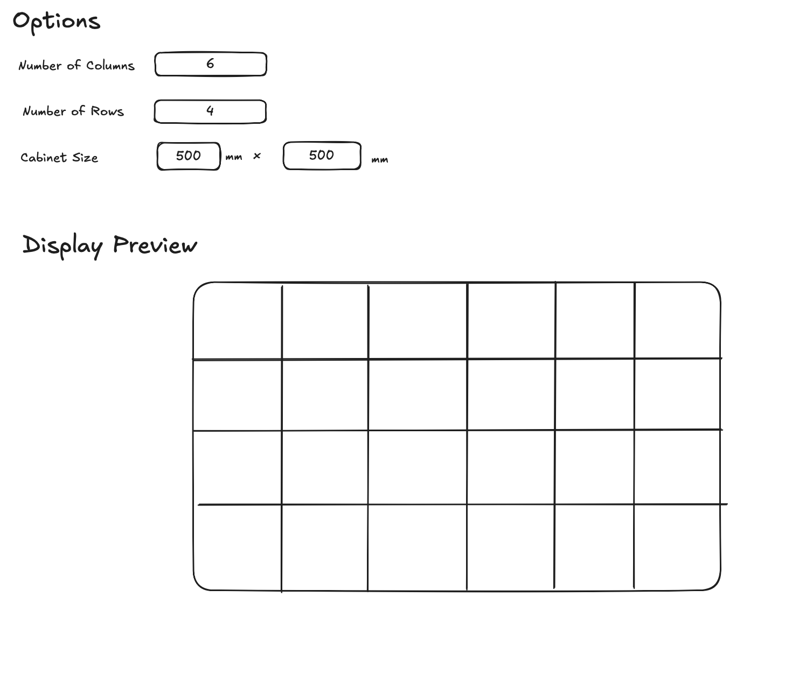

# Arterio Technical Interview Challenge

Welcome to the Arterio technical interview challenge! This exercise is designed to test your development skills in the context of our core business - digital LED display configuration.

## Challenge Overview

Your task is to create a simplified version of our display configurator using React. This will demonstrate your ability to handle dynamic rendering, user input processing, and visual representation of technical specifications.

## Requirements

### 1. Display Configurator Tool

Create an interactive tool that generates a preview of an LED display based on user inputs. The tool should include:

- Input fields for:
  - Number of columns in the display
  - Number of rows in the display
  - Cabinet size (individual LED panel dimensions)
- Real-time preview rendering of the configured display
- Proper scaling and proportions maintenance
- Clean, intuitive user interface

The above sketch illustrates the expected layout and key components of the display configurator interface.

### 2. Display Specs

Show the main displays specs underneath the display:

- Width and height in mm
- Resolution
- Total number of cabinets
- Diagonal in inches

### 3. Background Image Integration

Enhance the configurator by:

- Adding functionality to display a background image
- Ensuring the display preview overlays correctly on the background

## Technical Specifications

- Use React with TypeScript
- For styling you can use Tailwind but using css files is also fine
- Ensure smooth performance with real-time updates

## Evaluation Criteria

We will assess your submission based on:

- Code quality and organization
- Problem-solving approach
- Attention to detail

## Getting Started

1. Clone this repository
2. Install dependencies using `npm install`
3. Start the development server using `npm run dev`
4. Begin implementing the requirements in the `src` directory
